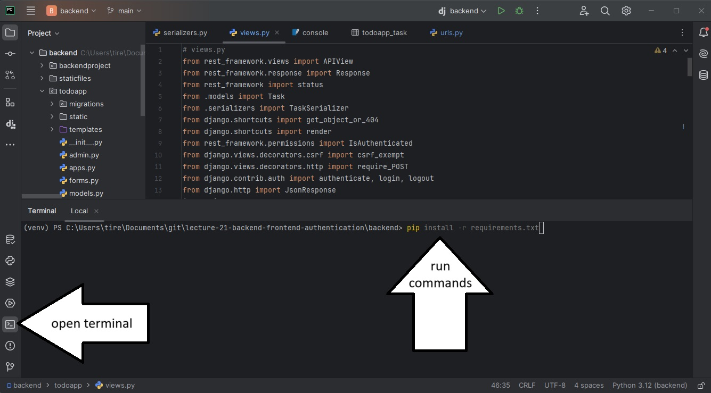

# Resume Builder

## Prerequisites (for your personal computers)

* Ensure Python is installed: https://www.python.org/downloads/
* Ensure Pycharm is installed: https://www.jetbrains.com/pycharm/download/?section=windows
* Ensure Git is installed: https://git-scm.com/downloads

If you needed to install Python or Git, you'll need to restart your computer before continuing.

## App Setup

**TL;DR: run this command before doing anything else:** `git config --global core.editor "nano"` 

1) Open a terminal and navigate to the folder you want to create your project in (e.g. `cd ~Documents/Code`)
2) Clone the repository with `git clone https://github.com/Carleton-BIT/project-AliciaMcG.git`
*If you are experiencing trouble with git, try restarting your computer. If that doesn't work, switch to a lab computer for now and post in the forums with a screenshot of the error after the lab*
3) In PyCharm, go to file->open and select the cloned folder called `BIT2008-project-template`
4) Open a terminal using PyCharm and install dependencies using `pip install -r requirements.txt`

5) Create a file called `.env` in the top level directory
6) Generate a secret key by running `python -c 'from django.core.management.utils import get_random_secret_key; print(get_random_secret_key())'` in the terminal. Copy the output.
7) Edit the `.env` file and add a line that says `SECRET_KEY="your-secret-key-here"`. Paste the output from part 6 into 'your-secret-key-here'.
8) On the terminal, run `python manage.py migrate`

## Running the App
Run the server by clicking the play button or running `python manage.py runserver` on the terminal.
Navigate to 127.0.0.1:8000, or the local host url which is printed in the terminal when you run the server.
